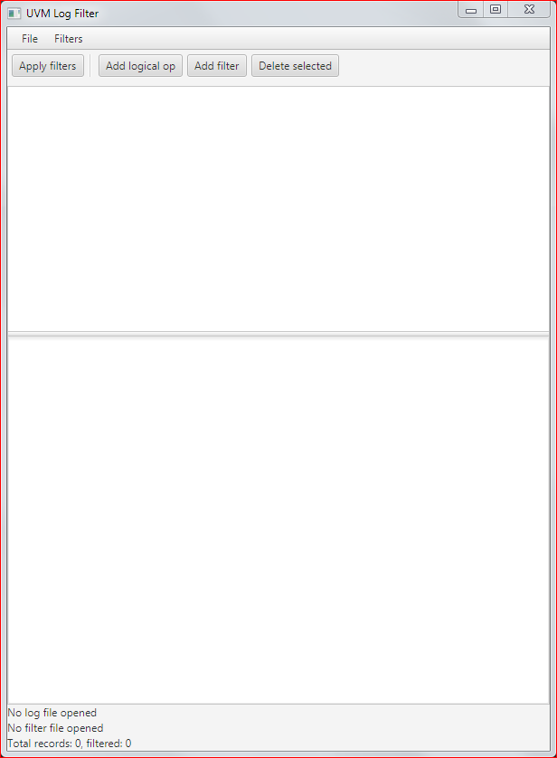

# uvmlogfilter
A Java program to filter UVM logs

## Purpose
The goal of this program is to perform filtering of UVM logs to extract only informations that may be interesting to the user.
The whole log is divided in records. The first one starts at the first line recognized as a UVM_* message, and ends at the last line before the next UVM_* message (or at the end of the file).
Currently logs can be filtered based on:

* Severity
* Id
* Time
* Component
* Hierarchy
* Text (in the entire record except the first line)

Basic filters like the ones described above can be combined using logical operators (AND,OR,NOT) to produce more complex filters.
The result of filtering can be saved in a text file.
## Usage
The simplest way to launch the program is to download the latest released .jar file from [Releases](https://github.com/Loneknight73/uvmlogfilter/releases).
After launching it (by double clicking on it or, using a terminal, by typing "java -jar </path/to/jar>"), this window opens:

You can start adding filters, even without opening a file first.
The first thing to do is to click on "Add logical op" since the root of the filter tree. For example, choose "AND".

Then, after selecting the row with "AND", click on "Apply filter". For example, choose the "Id" filter in the leftmost combo box:

Click OK, then, after selecting "AND" again, click again on "Apply filter". This time choose "Time":

The window will look like:

You can now open a log file via "File -> Open" (you can try [./log/hier.log](./log/hier.log) in this repository). The file name will be displayed in the status bar at the bottom.
You can now press "Apply filters":

and in the text area only the UVM records with id="c2" and time between 100 and 200 will be displayed. You can then choose to save the filtering results in a new file using "File -> Save as ..."

