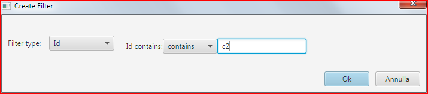
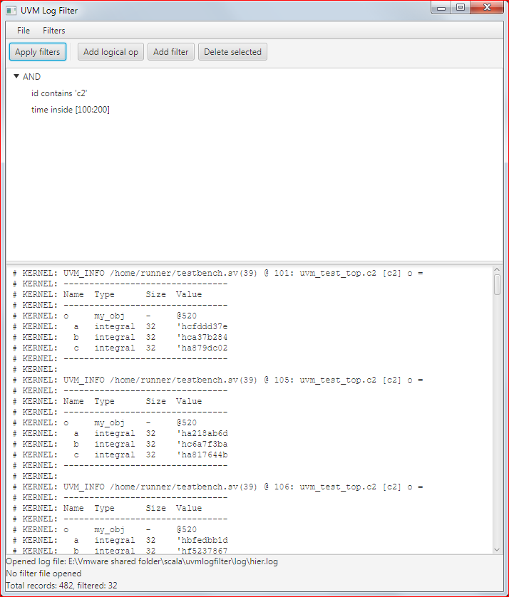

# uvmlogfilter
A Scala program to filter UVM logs

## Purpose
The goal of this program is to perform filtering of UVM logs to extract only information that may be interesting to the user.
The whole log is divided in records, that start at lines recognized as a UVM_* message, 
and end at the last line before the next UVM_* message (or at the end of the file).
Currently logs can be filtered based on:

* Severity
* Id
* Time
* Component
* Hierarchy
* Text (in the entire record except the first line)

Basic filters like the ones described above can be combined using logical operators (AND,OR,NOT) to produce more complex filters.
The filter expression tree can be saved in a JSON file and reloaded later.
The result of the filtering operation (i.e. the filtered records) can be saved in a text file.
## Usage
The simplest way to launch the program is to download the latest released .jar file from [Releases](https://github.com/Loneknight73/uvmlogfilter/releases).
After launching it (by double clicking on it or, using a terminal, by typing "java -jar </path/to/jar>"), this window opens:

You can start adding filters, even without opening a file first.
The first thing to do is to click on "Add logical op" since the root of the filter tree. For example, choose "AND".

Then, after selecting the row with "AND", click on "Apply filter". For example, choose the "Id" filter in the leftmost combo box:

Click OK, then, after selecting "AND" again, click again on "Apply filter". This time choose "Time":

The window will look like:

You can now open a log file via "File -> Open" (you can try [./log/hier.log](./log/hier.log) in this repository). The file name will be displayed in the status bar at the bottom.
You can now press "Apply filters":

and in the text area only the UVM records with id="c2" and time between 100 and 200 will be displayed. You can then choose to save the filtering results in a new file using "File -> Save as ..."

It is possible to modify already existing filters/logical operations by double clicking on them.

In the status bar, at the bottom of the window, you can find some useful information:
* name of the log file opened
* name of the filter file loaded
* number of the total log records parsed and of those filtered 

## Filter save/restore
It is possible to save and restore the filters entered through the GUI in a JSON file, to be able to use them
in a different session without having to rebuild the filtering expression tree by hand.

## Limitations
The program is currently only a prototype, but it can be used.
However it does not come with any guarantee, so you run at your own risk.
I am not a professional Scala programmer, so for this and other reasons, this program has tons of functional, stylistic and performance issues.
Here I will list some of the possible improvements:

* I have tried the program on some logs at work. Its performance was not a problem, but the logs were not huge.
  On very big logs it may be unbearably slow. A possible solution, in this case, might be to use Spark.
* The GUI is not particularly user friendly, for example copy/paste of filter subtrees or drag and drop of the same is not supported
* Error conditions are not checked very thoroughly
* UVM messages line parsing may fail, if they are not formatted in the standard way

Contributing UVM logs on which the program does not work, or just as an help to test the program is welcome.
Of course, this is true only if you are allowed by your organization and if the logs do not disclose any sensitive information.
  

